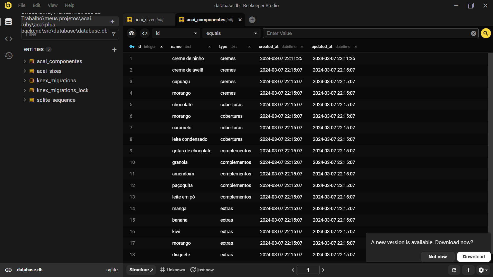
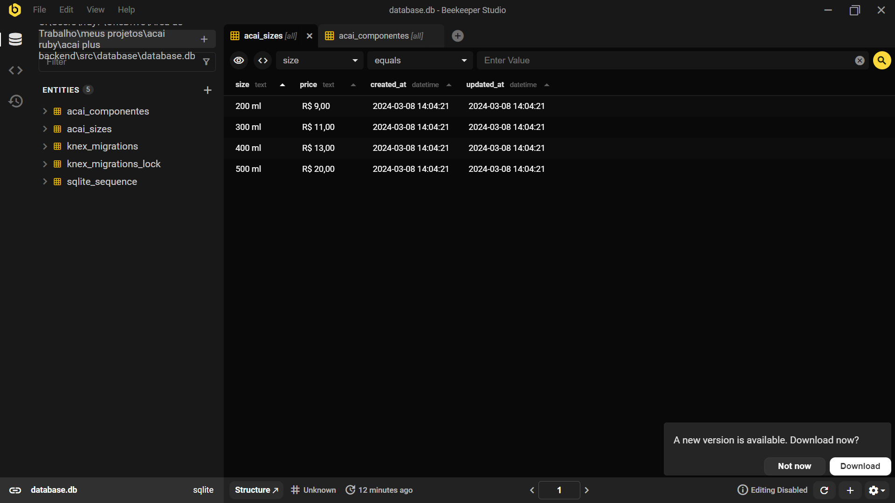

API para o projeto Açaí Ruby. Essa API NodeJS gera um banco de dados SQLite que armazena os componentes de açaí da açaiteria Ruby e permite fazer requisições http para a gestão do totem e a otimização do processo de pedidos.

> Acesso: [api-acai-plus.onrender.com](https://api-acai-plus.onrender.com/)

 

    

 

    

##

---

  Made with 💜 by <a href="https://www.linkedin.com/in/rayane-ac%C3%A1cio-274092252/"> Rayane Acácio </a>

